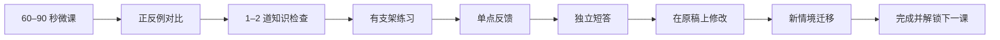

# STG v0.5 渐进式学习与项目制训练优化方案

> 状态：P0–P2 与 Day 7 毕业项目已实现；开发者连续自测与真人价值验证待执行
> 版本建议：`v0.5.0-beta.1`
> 核心目标：让第一次使用者先理解、再模仿、再独立表达，最终完成一次可复核的结构化汇报项目。

当前实现证据：

- `/training-demo`：Day 1–7、顺序解锁、继续入口、毕业总结和刷新恢复；
- `/training-demo/classic`：保留 v0.4 无提示水平检查；
- 33 个 Vitest 文件、480 项测试和 32 条桌面/移动端 Playwright 流程作为闭环验收基线；
- v0.4 的 180 条规则评测与 54 条合成轨迹继续通过；
- 七天工程闭环已完成；当前实现仍不等于真实用户价值、长期保持或相对 ChatGPT 的效果已经完成验证。

## 1. 当前问题

当前 v0.4 的评估机制已经较可靠，但教学顺序不适合零基础用户：

- 页面在用户作答前明确隐藏方法，知识讲解要到冷回答完成后才出现。
- 第一天第一题就要求用户同时理解受众、提炼目的、组织信息并提出行动请求。
- 三个训练日可以任意选择，没有前置知识、难度标识和解锁关系。
- 三天分别训练三个微技能，但没有把它们组合成一条“从单句到完整汇报”的能力成长线。
- 冷答、修改和迁移都有价值，但首次体验中的开放式输入比例仍然过高。

因此，当前流程更像“测评工具”，还不像“面向新手的训练课程”。

## 2. 课程设计原则

### 2.1 先教后练，但不直接泄露答案

首次学习一个概念时，采用：

`微课 → 正反例对比 → 选择判断 → 半开放练习 → 独立表达 → 迁移`

知识示例和正式练习必须使用不同情境。用户可以学到方法，但不能复制示例完成考题。

### 2.2 每次只增加一个难度变量

难度由六个维度共同决定：

1. 新概念数量；
2. 情境信息量；
3. 输出长度；
4. 是否提供句式支架；
5. 迁移距离；
6. 是否延迟、无提示完成。

每一课只提升其中一个主要维度，避免突然从选择题跳到完整工作汇报。

### 2.3 识别题负责建立信心，开放题负责证明能力

- 选择、排序和填空用于理解知识，不计入最终技能达标。
- 半开放和开放回答用于观察用户是否能主动组织语言。
- 最终项目、未见迁移题和延迟题不提供答案模板。
- 完成学习步骤不等于技能达标，两种状态继续分开记录。

### 2.4 微课必须短

每个知识点只保留：

- 一句话说明“这是什么”；
- 一句话说明“为什么有用”；
- 一组正反例；
- 一个可执行公式；
- 一个常见错误。

单次阅读目标为 60–90 秒，Day 1–5 整课目标为 3–6 分钟，Day 6 组合汇报目标不超过 7 分钟。

## 3. 七天难度曲线

| 天数 | 学习目标 | 主要题型 | 支架程度 | 开放输入 |
|---|---|---|---|---|
| Day 1 | 识别“受众”和“希望对方做什么” | 正反例、单选、连线 | 完整支架 | 无 |
| Day 2 | 写出一句明确目的 | 填空、改错、一句话表达 | 高支架 | 1 句 |
| Day 3 | 把结论放到第一句 | 句子排序、二选一、改写首句 | 中高支架 | 1–2 句 |
| Day 4 | 用一个理由支撑结论 | 选择依据、补全“结论＋原因” | 中支架 | 2 句 |
| Day 5 | 把信息整理成两到三点 | 信息卡分组、选择类别、短答 | 部分支架 | 3–4 句 |
| Day 6 | 完成一次完整工作汇报 | 目的＋结论＋两到三点＋行动请求 | 低支架 | 4–6 句 |
| Day 7 | 完成毕业项目与未见迁移 | 固定新情境、无模板表达、修改、迁移 | 无支架 | 完整短汇报 |

### Day 1：先看懂结构

知识：

- 表达不是把知道的都说出来，而是让特定对象知道、决定或行动。
- “受众”和“期望行动”决定信息取舍。

练习：

1. 从两个回答中选出目的更清楚的一个；
2. 从一句工作任务中识别受众；
3. 选择希望对方“知道、决定、批准或执行”的结果。

成功体验：不要求写长句，用户首次进入 2 分钟内应能完成一课。

### Day 2：只写一句明确目的

公式：

`我要向［谁］说明［什么］，希望对方［做什么］。`

练习：

1. 填补受众或行动；
2. 修改一个“只有背景、没有目的”的句子；
3. 独立写一句目的。

本日只评估目的是否明确，不评估结论位置或分组。

### Day 3：结论先行

知识：

- 先回答对方最关心的问题，再补背景和依据。

练习：

1. 比较“背景先行”和“结论先行”；
2. 拖动句子，把核心判断放到第一位；
3. 改写一段回答的第一句；
4. 用新情境写 1–2 句回答。

### Day 4：结论加一个理由

公式：

`我的判断是［结论］，主要因为［最关键依据］。`

重点不是写长，而是让后一句真正支撑前一句。

### Day 5：两到三点框架

知识：

- 同类信息放在一起；
- 分组之间不能重复；
- 每组都要服务于同一个结论。

练习先用信息卡分组，再让用户用自己的话完成三到四句短答。

### Day 6：完整工作汇报

组合前三个微技能：

1. 明确受众与目的；
2. 第一段给结论；
3. 用两到三点支撑；
4. 以明确行动请求收尾。

先提供可折叠提纲，不提供完整答案。用户成功一次后隐藏提纲，完成同难度新题。

### Day 7：毕业项目

毕业项目使用固定、未见过且可确定性评分的职场情境：

`阅读材料 → 规划结构 → 独立短汇报 → 证据反馈 → 必要时原稿修改 → 新场景迁移 → 选择题式自检 → 推荐复练`

毕业项目证据条件：

- 目的达标；
- 首句包含核心判断；
- 至少两个不同且相关的支撑点；
- 首稿有缺口时，修改不能只替换少量词语；首稿已完整时不为留痕强制改写；
- 必须完成一次未见迁移提交；是否首次达到门槛单独记录，不能被后续修改覆盖。

完成七天流程不等于迁移达标。首次未达到规则时，用户可以根据反馈再试，也可以结束流程并在总结中标记“待加强”，避免永久卡死或用修改后的结果伪装首次表现。

迁移待加强不是终点：总结页保留首次结果并提供“继续完成新场景迁移”。完成三道选择题式自检后，系统只推荐一个 Day 2–6 复练动作并可一键进入，形成下一轮训练入口。

“应用到我的真实工作”可以作为额外练习，但在没有可靠语义评分器时不作为权威毕业成绩。

## 4. 单课交互流程



首次学习必须先看微课。已经完成过的用户可以选择“快速复习”后直接进入独立练习。

## 5. 失败后的降难度机制

系统不应只提示“未达标”，而应把用户送回最接近的可完成步骤：

| 观察到的问题 | 下一步支架 |
|---|---|
| 不知道写什么 | 重新显示受众、目标和句式骨架 |
| 有背景但无目的 | 先做一次“选择期望行动” |
| 结论位置错误 | 先做句子排序，再改写首句 |
| 分点重复 | 先用信息卡重新分组 |
| 连续两次未达标 | 展示新的正反例，不重复原题答案 |
| 已达标 | 逐步隐藏模板，进入新情境 |

支架使用次数要记录，但不作为负面分数；它反映用户目前需要哪类帮助。

## 6. 页面与导航改造

### 首页

- 主按钮改为“从第一课开始”。
- 次按钮为“我有基础，先做水平检查”。
- 明确显示：免费、每天 5 分钟、七天完成一个结构化汇报项目。

### 课程地图

- Day 1 默认解锁，Day 2–7 逐日解锁。
- 每课显示“今天学什么、预计用时、难度、完成状态”。
- 不再用三个外观相同的“职场短答”按钮。

### 训练页

- 顶部同时显示课程位置和当前步骤，例如“Day 3 / 7 · 第 2 步：句子排序”。
- 知识卡与练习卡视觉分开。
- 用户在开始开放回答前，已经完成至少一次低风险知识检查。
- 每次反馈只指出一个当前课程目标内的问题。

### 完成页

- 展示“今天学会的动作”，而不是只显示抽象分数。
- 对比原稿与修改稿；
- 明确下一课会增加什么难度；
- Day 7 展示毕业项目证据，不宣称被证明的长期能力提升。

## 7. 数据契约调整

建议新增以下课程字段：

```ts
type ExerciseKind =
  | "recognize"
  | "reorder"
  | "fill"
  | "guided_write"
  | "independent_write"
  | "transfer"
  | "final_project";

type ScaffoldLevel = "full" | "partial" | "none";

type ProgressiveLesson = {
  day: 1 | 2 | 3 | 4 | 5 | 6 | 7;
  difficulty: 1 | 2 | 3 | 4 | 5 | 6 | 7;
  prerequisiteDay?: number;
  conceptGoal: string;
  estimatedMinutes: number;
  lesson: {
    definition: string;
    value: string;
    badExample: string;
    goodExample: string;
    formula: string;
    commonMistake: string;
  };
  exercises: Array<{
    id: string;
    kind: ExerciseKind;
    scaffoldLevel: ScaffoldLevel;
    countsForSkillStatus: boolean;
  }>;
};
```

新增进度事件：

- `lesson_viewed`
- `knowledge_check_completed`
- `scaffold_used`
- `guided_practice_completed`
- `independent_practice_completed`
- `lesson_unlocked`
- `final_project_completed`

## 8. 与参考书的关系

公开目录显示，《结构化表达：如何汇报工作、演讲与写作》的内容顺序先介绍结构化表达的概念、特点和工具，再进入工作汇报中的明确目的、结论先行、预先确定框架、简洁表达和“讲三点”等具体应用。

STG 采用这一“先理解原理、再进入场景”的教学逻辑，但：

- 不复制付费书籍的正文、案例、练习或原句；
- 知识卡、正反例和题目全部独立编写；
- 第一版聚焦书中公开目录可对应的工作汇报基础，不扩张到客户沟通、故事、演讲和写作；
- 后续扩展需继续保持原创内容和可验证评分边界。

参考：

- 微信读书书目：<https://weread.qq.com/web/reader/6de32530727eced86de15b9>
- 得到电子书公开简介与目录：<https://www.dedao.cn/ebook/detail?id=V5R16yPmaYOMqGRAv82jkX4KDe175w7XYR0rbx6pNgznl9VZPLJQyEBodb89mqoO>

## 9. 实施顺序

### P0：课程契约与内容原型

- 建立七天课程类型、难度和前置关系；
- 独立编写 Day 1–2 的知识卡、正反例和低门槛题；
- 将现有三个微技能重新映射到 Day 2–5；
- 冻结 Day 7 项目题和评分锚点。

退出标准：内容评审可以清楚说明每一天只增加了哪个难度。

### P1：先学后练主流程

- 新增微课、例题、知识检查和引导练习页面；
- Day 1 默认进入知识讲解，不再首先显示开放题；
- 增加顺序解锁、课程地图和继续学习；
- 保留 v0.4 训练页作为可回退版本。

退出标准：新用户在第一次开放输入前已经理解并正确识别本课概念。

### P2：渐隐支架与组合训练

- 实现填空、排序、信息卡分组和可折叠提纲；
- 根据失败类型提供对应支架；
- Day 6 组合三个微技能；
- Day 7 使用无支架项目和未见迁移。

退出标准：用户不能只靠选择题完成课程或获得毕业状态。

### P3：评估、回归与发布

- 为每种题型增加单元与 Contract 测试；
- Playwright 覆盖 Day 1 首次成功、失败降难度、顺序解锁、Day 7 项目和移动端；
- 扩展确定性 Eval，分别报告知识理解、独立表达和迁移，不合并为单一能力分；
- 运行 7–14 天开发者自测，记录难度感、放弃冲动、支架使用和完成时间。

退出标准：Day 1 无高压开放题、Day 1–7 顺序可恢复、所有权威评分来自开放回答。

## 10. 验收标准

### 产品验收

- 第一次进入后，首个任务是知识讲解与简单识别，不是完整职场汇报。
- Day 1 可以在 2–3 分钟内完成，且不要求长文本输入。
- 每个开放题之前，用户知道本题只练什么。
- 难度、预计时间和解锁条件始终可见。
- Day 7 明显比 Day 1 更难，但使用的知识都在前六天出现过。

### 教学验收

- 识别题达标不能直接记为技能达标。
- 有提示练习达标不能替代无提示迁移。
- 反馈只检查当前已讲授的知识，不提前惩罚下一课内容。
- 示例与正式考题不使用同一情境或可复制答案。

### 工程验收

- 刷新和跨步骤恢复不丢失课程状态；
- 未解锁课程不能通过直接点击进入；
- v0.4 的可信评估、原文证据、事实保护和零外部模型调用继续成立；
- 桌面和移动端完整七天流程均有自动化覆盖。

## 11. 版本边界

本轮建议命名为 `v0.5.0-beta.1`，因为它是 `1.0` 之前的第五个产品能力迭代，不是第三个已经稳定兼容的正式大版本。该版本只完成“渐进教学＋七天毕业项目”，暂不同时加入语音、生成式 AI、支付或复杂自适应算法。
