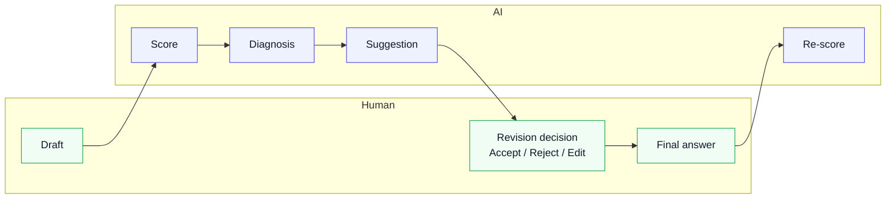

# AI Boundary

Reusable Mermaid source for explaining what the AI does and what the human user controls.

```mermaid
flowchart LR
  subgraph human["Human"]
    draft["Draft"]
    decision["Revision decision<br/>Accept / Reject / Edit"]
    finalAnswer["Final answer"]
  end

  subgraph ai["AI"]
    score["Score"]
    diagnosis["Diagnosis"]
    suggestion["Suggestion"]
    rescore["Re-score"]
  end

  draft --> score
  score --> diagnosis
  diagnosis --> suggestion
  suggestion --> decision
  decision --> finalAnswer
  finalAnswer --> rescore

  classDef humanClass fill:#F0FDF4,stroke:#16A34A,color:#111827;
  classDef aiClass fill:#EEF2FF,stroke:#4F46E5,color:#111827;

  class draft,decision,finalAnswer humanClass;
  class score,diagnosis,suggestion,rescore aiClass;
```
