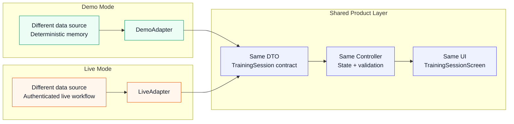

# Demo vs Live Mode

Reusable Mermaid source for showing how STG keeps one product experience while switching data sources.

```mermaid
flowchart LR
  subgraph demo["Demo Mode"]
    demoSource["Different data source<br/>Deterministic memory"]
    demoAdapter["DemoAdapter"]
  end

  subgraph shared["Shared Product Layer"]
    gateway["Same DTO<br/>TrainingSession contract"]
    controller["Same Controller<br/>State + validation"]
    ui["Same UI<br/>TrainingSessionScreen"]
  end

  subgraph live["Live Mode"]
    liveAdapter["LiveAdapter"]
    liveSource["Different data source<br/>Authenticated live workflow"]
  end

  demoSource --> demoAdapter
  demoAdapter --> gateway
  liveSource --> liveAdapter
  liveAdapter --> gateway
  gateway --> controller
  controller --> ui

  classDef demoClass fill:#ECFDF5,stroke:#059669,color:#111827;
  classDef sharedClass fill:#EEF2FF,stroke:#4F46E5,color:#111827;
  classDef liveClass fill:#FFF7ED,stroke:#EA580C,color:#111827;

  class demoSource,demoAdapter demoClass;
  class gateway,controller,ui sharedClass;
  class liveAdapter,liveSource liveClass;
```
