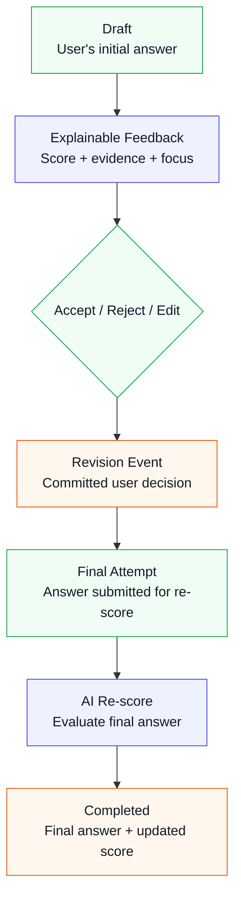

# Human-AI Revision Flow

Reusable Mermaid source for explaining the user-facing Human-AI revision loop.

```mermaid
flowchart TB
  draft["Draft<br/>User's initial answer"]
  feedback["Explainable Feedback<br/>Score + evidence + focus"]
  decision{"Accept / Reject / Edit"}
  event["Revision Event<br/>Committed user decision"]
  final["Final Attempt<br/>Answer submitted for re-score"]
  rescore["AI Re-score<br/>Evaluate final answer"]
  completed["Completed<br/>Final answer + updated score"]

  draft --> feedback
  feedback --> decision
  decision --> event
  event --> final
  final --> rescore
  rescore --> completed

  classDef user fill:#F0FDF4,stroke:#16A34A,color:#111827;
  classDef ai fill:#EEF2FF,stroke:#4F46E5,color:#111827;
  classDef system fill:#FFF7ED,stroke:#EA580C,color:#111827;

  class draft,decision,final user;
  class feedback,rescore ai;
  class event,completed system;
```
