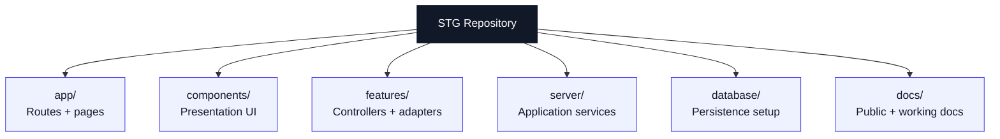

# Repository Map

Reusable Mermaid source for showing the main STG project areas without implementation-level details.

```mermaid
flowchart TB
  repo["STG Repository"]

  app["app/<br/>Routes + pages"]
  components["components/<br/>Presentation UI"]
  features["features/<br/>Controllers + adapters"]
  server["server/<br/>Application services"]
  database["database/<br/>Persistence setup"]
  docs["docs/<br/>Public + working docs"]

  repo --> app
  repo --> components
  repo --> features
  repo --> server
  repo --> database
  repo --> docs

  classDef root fill:#111827,stroke:#111827,color:#FFFFFF;
  classDef module fill:#EEF2FF,stroke:#4F46E5,color:#111827;

  class repo root;
  class app,components,features,server,database,docs module;
```
