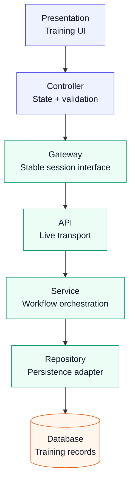

# System Architecture

Reusable Mermaid source for showing the high-level STG system layers in README, portfolio pages, or presentation slides.

```mermaid
flowchart TB
  presentation["Presentation<br/>Training UI"]
  controller["Controller<br/>State + validation"]
  gateway["Gateway<br/>Stable session interface"]
  api["API<br/>Live transport"]
  service["Service<br/>Workflow orchestration"]
  repository["Repository<br/>Persistence adapter"]
  database[("Database<br/>Training records")]

  presentation --> controller
  controller --> gateway
  gateway --> api
  api --> service
  service --> repository
  repository --> database

  classDef product fill:#EEF2FF,stroke:#4F46E5,color:#111827;
  classDef boundary fill:#ECFDF5,stroke:#059669,color:#111827;
  classDef storage fill:#FFF7ED,stroke:#EA580C,color:#111827;

  class presentation,controller product;
  class gateway,api,service,repository boundary;
  class database storage;
```
